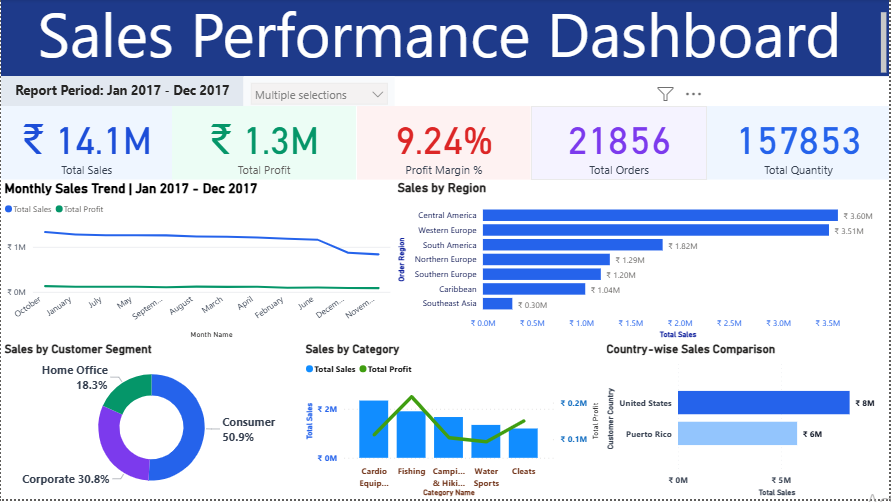

# 📊 Sales Performance Analysis Dashboard – Power BI

An interactive Business Intelligence dashboard developed using **Power BI** to analyze sales performance, profitability, and regional insights for the year 2017.




---

## 🚀 Project Overview

This dashboard provides a comprehensive analysis of business performance using key financial and operational metrics. It enables data-driven decision-making through dynamic visualizations and interactive filtering.

---

## 📈 Key KPIs Included

- 💰 Total Sales  
- 📊 Total Profit  
- 📦 Total Quantity Sold  
- 🛒 Total Orders  
- 📉 Profit Margin (%)  

---

## 📊 Dashboard Features

- 📅 Monthly Sales & Profit Trend Analysis  
- 🗂 Sales by Category (Technology, Furniture, Office Supplies)  
- 🌍 Sales by Region Comparison  
- 👥 Sales by Customer Segment (Consumer, Corporate, Home Office)  
- 🌎 Country-wise Sales Comparison  
- 🔎 Interactive Report Period Slicer  

---

## 🎯 Business Insights Generated

- Identified top-performing product categories  
- Compared profitability across customer segments  
- Analyzed regional sales distribution  
- Observed monthly performance trends  
- Evaluated country-level sales contribution  

---

## 🛠 Tools & Technologies Used

- Power BI Desktop  
- DAX (Data Analysis Expressions)  
- Data Modeling  
- Data Visualization Best Practices  

---

## 📂 Dataset

Sample sales dataset (2017) used for analytical and visualization purposes.

---

## 🧠 What I Learned

- KPI design & dashboard structuring  
- Data modeling and relationship management  
- Creating dynamic measures using DAX  
- Applying professional color harmony  
- Business storytelling through data  

---

## 📌 Author

**Dheeraj R. Singh**  
📎 GitHub: https://github.com/DHEERAJ09R08SINGH  
🔗 LinkedIn: [https://www.linkedin.com/in/dheeraj-r-singh/](https://www.linkedin.com/in/dheeraj-r-singh-9b4370250/)


---

⭐ If you found this project useful, feel free to star the repository!
```
